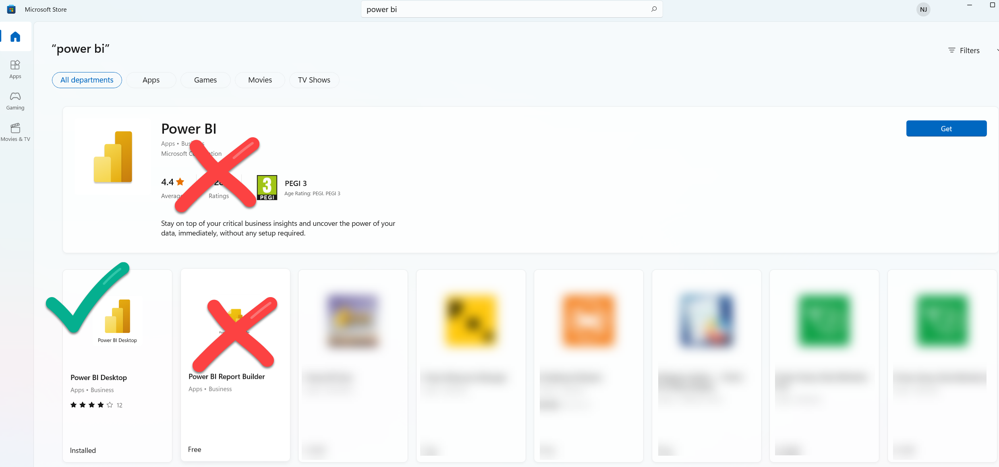

# Introductie Power BI

## Power BI Desktop downloaden en de eerste start

### Downloaden van Power BI

Power BI Desktop is gratis te downloaden en op elke Windows-machine installeren. Mocht dat op jouw computer nog niet gedaan zijn, dan kun je Power BI downloaden vanaf de Windows Store, of vanaf [www.powerbi.com](https://powerbi.microsoft.com/nl-nl/). Wanneer het mogelijk is, installeer Power BI Desktop dan vanuit de Windows Store: dit zorgt ervoor dat je automatisch updates e.d. krijgt, en deze niet handmatig hoeft te downloaden.

Wanneer je Power BI wilt installeren vanuit de Windows Store, let dan goed op! Zoals je ziet zijn er namelijk twee edities:

* **Power BI Desktop** is de tool waarmee je rapporten kunt bewerken en vormgeven
* **Power BI** is een tooltje voor tablets waarmee je rapporten enkel kunt weergeven

### De eerste start

De eerste keer dat je Power BI start zie je het volgende scherm:

Klik op "Get Started" om in te loggen en met Power BI te starten.

Waarschijnlijk heb je nog niet automatisch een Power BI account. Je kunt met de knop **Sign up for Power BI** dit eenvoudig regelen. Als je dit proces in de browser volledig doorlopen hebt, kun je direct met je BITrainer.nl-account inloggen bij Power BI Desktop.

Het scherm ziet er nu als volgt uit:

Merk de volgende zaken op:

1. Linksboven zie je drie knoppen, waarmee je tussen *drie weergaven* van je Power BI model kunt schakelen:
   * **Report**
   * **Data**
   * **Model**
2. Bovenin zie je een **ribbon** (of "lint"), die net werkt als in Office kent. De lint heeft zeven onderdelen:
   * **File** (menu): Vergelijkbaar met het gelijknamige menu uit Office: opslaan, exporteren, printen en instellingen
   * **Home**: Hier staan de meeste "basis" zaken die je nodig hebt voor het maken van Power BI-rapportages
   * **Insert**: Diverse zaken die je toe kunt voegen aan je rapportage
   * **Modeling**: Hier staan specifieke zaken voor het inrichten van je datamodel
   * **View**: Hier kun je visuele hulpmiddelen aan- en uitzetten, en schakelen tussen de mobiele weergave en de desktop-weergave
   * **Help**: Dit is een bijzonder ingewikkeld concept, dat voor nu te ver reikt om uit te leggen ;-)
   * **External Tools** wordt niet altijd weergegeven (hier op de screenshot wel), maar dit geeft de mogelijkheid om met andere software verder te bouwen aan Power BI-rapporten of -datamodellen
3. Aan de rechterzijde (paars omlijnd hierboven) zie je twee _panes_: **Visualizations** en **Filters**. Deze kun je in- en uitklappen door op de titel te klikken (try!). Er zijn drie grote onderdelen benoemd:
   * **Filters**: filters die van toepassing zijn op het huidige rapport, de huidige pagina, of de huidige visual
   * **Visualizations**: De verschillende visualisaties die je in een rapport kunt gebruiken.
   * **Fields** / **Format**: Hier zie je geen tekst van, maar dit zijn twee icoontjes waarmee je veel eigenschappen van visuals kunt instellen:  
   
   * **Drill trough**: Bijzondere drillthrough-filters (meer hierover later)
4. Uiterst rechts op het scherm (rood omrand) is het **Fields** pane. Ook deze kun je in- en uitklappen. Hier zie je een lijst van alle tabellen, kolommen en measures die in je datamodel aanwezig zijn
5. Binnen de Report-weergave, zie je onderin de verschillende **pagina's** van een rapport
6. Binnen de Report-weergave is een groot wit vel aanwezig - de **canvas**. Hierop kun je je rapport vormgeven. De zwarte stippellijnen geven de randen aan.

## Volgende modules

De volgende module is [Module 2: Rapporteren op de dataset: Power BI als rapportageschil](../02-reporting-on-dataset/02-reporting-on-dataset.md). Hieronder vind je een overzicht van alle modules:

1. [Introductie Power BI Desktop](../01-introduction/01-introduction-powerbi-desktop.md) (huidige module)
2. [Rapporteren op Power BI Datasets en eerste visualisatie](../02-reporting-on-dataset/02-reporting-on-dataset.md)
3. [Visuals en interactie](../03-visuals-and-interaction/03-visuals-and-interaction.md)
4. [Drillthrough](../04-drillthrough/04-drillthrough.md)
5. Self-service reporting
   * [CSV-bestanden inladen](../05-self-service-reporting/06-csv-inladen.md)
   * [SQL data inladen](../05-self-service-reporting/07-sql-inladen.md)
6. Data Modeling 101
   * [Relaties](../06-data-modeling-101/08-relaties.md)
   * [Opschonen van je datamodel](../06-data-modeling-101/09-opschonen.md)
7. [Introductie Power Query (GUI)](../07-power-query-gui/11-power-query.md)
8. [Publiceren en samenwerken in workspaces](../08-publishing-and-collaboration-in-workspaces/05-publishing-and-collaboration-in-workspaces.md)
9. [Calculated Columns met DAX](../09-dax/10-calc-columns.md)
