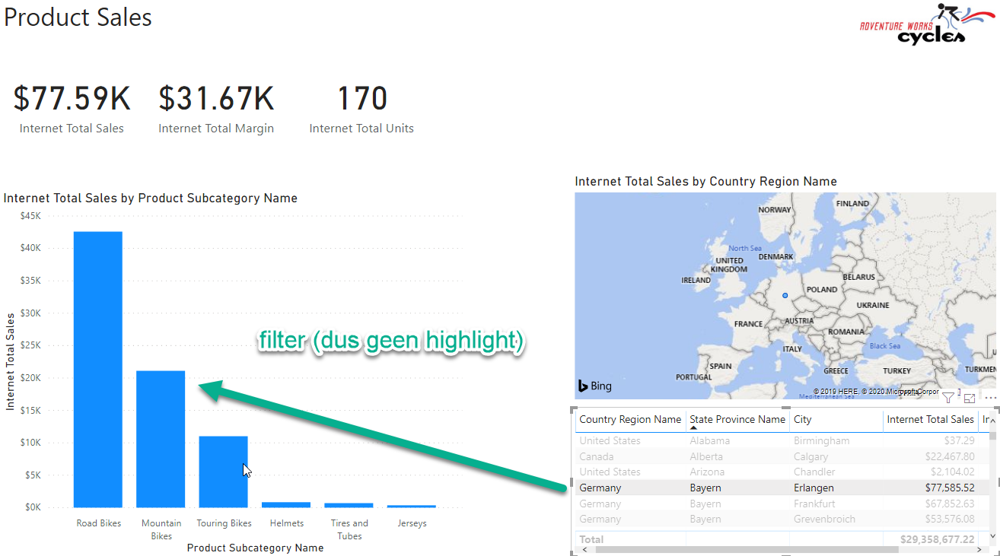
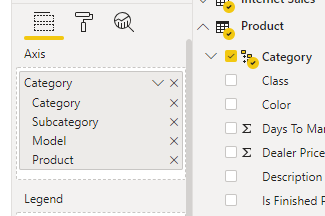
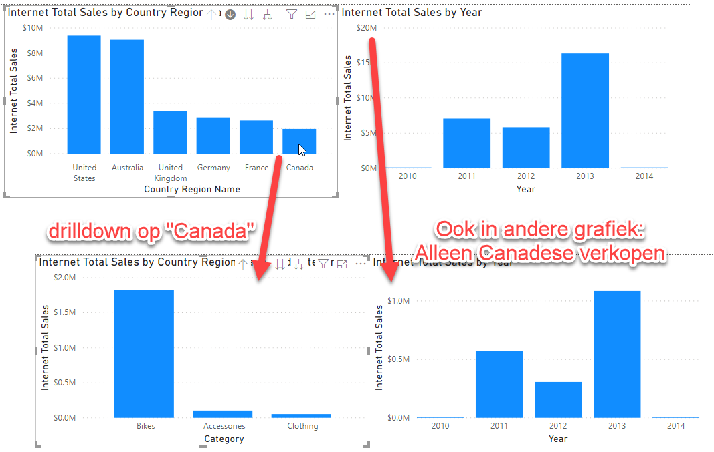

# Visuals, Drilldown and interaction

Binnen Power BI zitten veel mogelijkheden om de weergave en werking van je rapporten aan te passen. In deze module willen we hier iets verder naar kijken aan de hand van de volgende punten:

* Interacties tussen grafieken
* *Drilldown* en hiërarchie
* Voorgedefinieerde hiërarchie gebruiken
* Aanpassen van visuals
* *Custom visuals* van de *Power BI Marketplace*

## Voorbereiding

**Open** het bestand **startpunt-module-3.pbix**.

## Interactions

Zoals je in [de vorige module](../02-Reporting-on-Cube-Data/02-reporting-on-cube-data.md) gezien hebt, is er binnen Power BI automatisch *interactie* tussen de grafieken. Wanneer je op één grafiek klikt, heeft dit effect op een andere grafiek:

* Selecteer nu de rechtergrafiek op **Page 1** (*Internet Total Tax Amt by Total Children and Number of Children At Home*).

Op het moment dat je een grafiek selecteert, verschijnt er bovenin het scherm het groene menu *Visual Tools*:

* Selecteer de tab **Format**, en klik op de knop **Edit Interactions**

Je ziet nu in je rapport rechtsboven elk object waar data in zit *behalve de huidig geselecteerde grafiek* één of meer van de volgende icoontjes verschijnen:

Dit bepaalt hoe de bewuste grafiek zal reageren wanneer je de door jou geselecteerde grafiek van selectie verandert:

* **Filteren** (optie 1) - alle data die niet binnen de selectie valt, wordt niet weergegeven
* **Markeren** (optie 2, standaardinstelling) - alles buiten de selectie wordt lichter gekleurd weergegeven
* **Niet filteren** (optie 3) - er verandert niets, ongeacht wat je aanklikt

Probeer de drie opties uit, en zie de effecten.

Verander nu het rapport op de pagina **Product Sales** zodanig dat:

* Bij selectie van een Product Subcategory in de linkergrafiek (bijv. "Road Bikes") wordt de inhoud van de drie *card visuals* (*Internet Total Sales*, *Internet Total Margin* en *Internet Total Units*) niet gefilterd. Deze cijfers veranderen dus niets, ongeacht je selectie.
* Wanneer je rechtsonder in de tabel iets selecteert (bijv. "Germany"), wordt de linkergrafiek (*Internet Total Sales by Product Subcategory Name*) gefilterd. Hier zijn dus dan alleen de verkopen van die betreffende tabelrij zichtbaar.

Controleer de resultaten door "Road Bikes" te selecteren. Het resultaat zal als volgt zijn:

## Hiërarchie en drilldown

### Hiërarchie

Veel van de data die we analyseren heeft een hiërarchie in zich:

* Eerste analyses gebeuren op jaar- of kwartaalcijfers, daarna dalen we af richting maanden of dagen
* We starten met een analyse van de performance van accountmanagers, kijken daarna specifieker naar de onderliggende klanten
* We analyseren onze productverkopen per categorie, zien dat de meeste verkopen in fietsen zitten, dus splitsen we die uit in de subcategorieën.

In de datamodellen die we vanuit een kubus of Power BI-model afnemen, wordt data vaak al in een hiërarchie aangeboden. Bijvoorbeeld de Category-hiërarchie in de tabel *Product*:

* Open een nieuw tabblad
* Selecteer de *measure* **Internet Total Sales**
* Selecteer de *hiërarchie* **Category** in de tabel **Product**
* Bekijk de grafiek-eigenschappen. 
  * Onder "Axis" staat *Category*
  * Je ziet hier diverse niveaus (Category, Subcategory, Model, Product), toch is in de grafiek momenteel enkel het hoogste niveau zichtbaar.
  * Maak de grafiek wat breder, zodat je de volledige titel kunt zien. De titel is momenteel "Internet Total Sales by Category": het zichtbare niveau dus.

### Drilldown: eerste verkenning

Rechtsboven in de grafiek bevindt zich een verzameling met pijltjes. Deze zijn bedoeld om door de hiërarchie heen te navigeren.

* Klik op het pijltje naar beneden ().
  * Dit pijltje staat voor *drilldown* (de BI-term voor het "inzoomen" naar een lager niveau)
* Klik nu op de categorie "Bikes". Je ziet dat:
  1. De titel van de grafiek verandert naar *Internet Total Sales by Category and Subcategory*
  2. De subcategorieën op het Subcategory-niveau worden weergegeven *die zich binnen Bikes bevinden*
* Wanneer je weer wilt uitzoomen (*drill up*), klik je op het pijltje naar boven.

### Meer hiërarchie en drilldown

Een andere hiërarchie die in deze kubus aanwezig is, is de *Calendar* hiërarchie (binnen de tabel **Date**). 

* Maak een grafiek waarin de **Internet Total Sales** wordt uitgesplitst over **Calendar**.
* *Drilldown* naar het jaar 2010.
  * Zoals je ziet, filtert ook de grafiek **Internet Total Sales by Category** mee.

Wanneer we nu een *drill down* doen op een jaar, komen we eerst bij een semester, en daarna bij een kwartaal. Dat is wel een beetje veel van het goede. Daarom gaan we deze velden (voor deze specifieke grafiek) uit de hiërarchie halen.

* In de eigenschappen van de grafiek, onder *Axis*, verwijder de niveaus **Semester** en **Quarter**

De hiërarchie is nu *in deze grafiek* Jaar-Maand-Dag geworden. Verifieer dit.

### Handmatige hiërarchie

* Selecteer nu opnieuw de linkergrafiek *Internet Total Sales by Category*
* Sleep vanuit het **Fields** *pane* het veld **Country Region Name** uit de tabel **Geography** naar het **Axis** veld. Plaats het veld *boven* de *Category* hiërarchie.

De grafiektitel is nu *Internet Total Sales by Country Region Name*, en we kunnen via een *drilldown* verder afdalen door de *Category* hiërarchie, op basis van het land dat we bekijken.

### Go to the next level

Naast een *drilldown* kun je ook een niveau afdalen in de hiërarchie zonder dat je je specifiek beperkt tot één categorie. Dit kan met de rechter twee knoppen:

Ga in de linkergrafiek naar het hoogste niveau (dus *Country Region Name*), en probeer de laatste twee knoppen uit. Wat is het verschil?

### Filteren van andere visuals

Zoals je wellicht opgevallen is, zorgt een *drilldown* er ook voor dat andere grafieken gefilterd worden: wanneer je in de linkergrafiek een land selecteert, verandert de grafiek *Internet Total Sales by Year* ook mee:

Standaard werkt de filtering van een *drilldown* gelijk aan de filtering van een *selectie* (die je bijvoorbeeld via **Edit interactions** ingesteld hebt) binnen de grafiek. Je kunt de drilldown-filtering echter ook uitschakelen.

* Selecteer de linkergrafiek (*Internet Total Sales by Country Region Name*)
* Open het menu *Format*
* Naast de knop *Edit interactions* staat een vinkje bij **Drilling filters other visuals**. Schakel dit uit.

Nu zorgt een *drilldown* niet meer automatisch voor een filtering binnen een andere grafiek. Selecties werken nog wel.

## Volgende modules

De volgende module is [Publiceren en samenwerken in workspaces](../04-publishing-and-collaboration-in-workspaces/04-publishing-and-collaboration-in-workspaces.md). Hieronder vind je een overzicht van alle modules:

1. [Introductie Power BI Desktop](../01-Introduction/01-introductie-powerbi-desktop.md)
2. [Rapporteren op kubus-data en eerste visualisatie](../02-Reporting-on-Cube-Data/02-reporting-on-cube-data.md)
3. [Visuals en interactie](../03-Visuals-and-interaction/03-visuals-and-interaction.md) (huidige module)
4. [Publiceren en samenwerken in workspaces](../04-publishing-and-collaboration-in-workspaces/04-publishing-and-collaboration-in-workspaces.md)
5. [Drillthrough](../05-drillthrough/05-drillthrough.md)
6. Self-service reporting
   * [CSV-bestanden inladen](../06-self-service-reporting/03-csv-inladen.md)
   * [SQL data inladen](../06-self-service-reporting/04-sql-inladen.md)
7. Data Modeling 101
   * [Relaties](../07-Data-Modeling-101/05-relaties.md)
   * [Opschonen van je datamodel](../07-Data-Modeling-101/06-opschonen.md)
   * [Verrijken met Calculated Columns](../07-Data-Modeling-101/07-calc-columns.md)
8. [Introductie Power Query (GUI)](../08-Power-Query-GUI/08-power-query.md)

