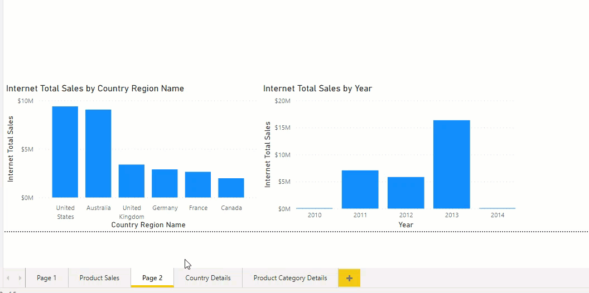
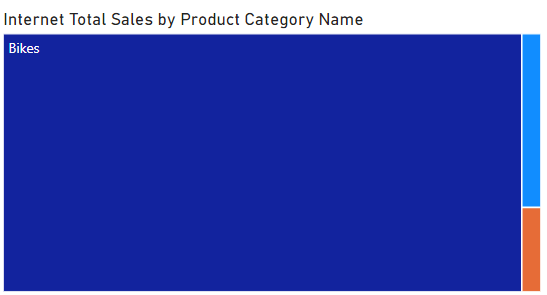
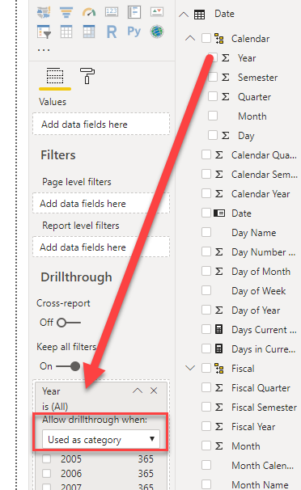
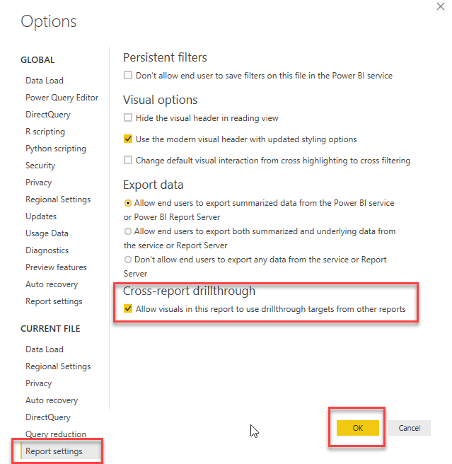
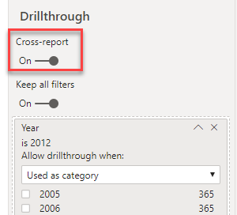
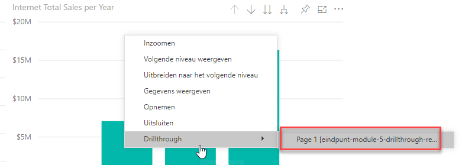
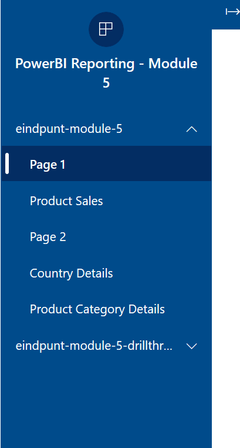

# Drillthrough

In [module 3](../03-visuals-and-interaction/03-visuals-and-interaction.md) hebben we al gekeken naar de *drilldown*: het "inzoomen" op lagere niveaus van de data.

De meeste Business Intelligence-tools kennen nog een tweede manier om de data aan een nader onderzoek te onderwerpen: de *drillthrough*. Dit houdt in de basis in dat je een getal onder de loep neemt op een andere pagina of in een ander rapport. Op deze manier kun je eenvoudig de context bekijken - bijvoorbeeld van de verkopen binnen een bepaald land:

## Drillthrough binnen een rapport

Wanneer je een drillthrough binnen een rapport mogelijk wilt maken, moet je de volgende zaken regelen:

1. Er moet een pagina zijn wat het *doel* van je drillthrough is. 
   * In het voorbeeld hierboven: de pagina "Country Details"
2. Op deze pagina moet je een "drillthrough filter" instellen. In het voorbeeld hierboven is dit de naam van het land: wanneer je die ergens in het rapport tegenkomt, kun je in twee klikken naar de drillthrough-pagina navigeren, wat dan automatisch gefilterd is op de betreffende categorie. 
   * In het voorbeeld hierboven is het *drillthrough* filter `Country Region Name`.

### Drillthrough instellen in je rapport

* Open het rapport 'startpunt-module-5.pbix'
* Voeg een pagina toe met de naam "Country Details"
* Voeg hierop een *map visual* toe (). Configureer deze als volgt:
  * **Location**: **State Province Name** (tabel *Geography*)
  * **Size**: **Internet Total Sales** (tabel *Internet Sales*)
* Voeg nu ook een zgn. "Treemap" toe voor *Internet Total Sales by Category*:  

* Klik ergens op het canvas zodat er geen *visual* meer geselecteerd is.
* Onder het kopje **Drillthrough** vind je nu een vakje "Add drillthrough filters here". Sleep hier het veld **Country Region Name** heen (tabel *Geography*)
* Ga terug naar de pagina *Page 2*, en rechtsklik op één van de landen in de grafiek. Als het goed is heb je nu een submenu *Drillthrough* naar de *Country Details*-pagina

Om het af te maken, kun je nu de **Country Details** pagina verbergen (rechtsklik op de tab). Publiceer de pagina naar een workspace, publiceer deze als app, en bekijk het resultaten in de app.

Probeer nu zelf een tweede drillthrough-pagina "Product Category Details" aan te maken waarbij je alle gegevens binnen een productcategorie op een rij zet. Filter op basis van het veld **Product Category Name** (tabel *Product Category*). Geef de volgende zaken weer:

*Bij elk punt staat wat extra uitdaging - deze hoef je niet uit te voeren. Mocht alles je echter gemakkelijk afgaan en je wilt wat meer de grenzen van Power BI opzoeken, dan kun je je hier even in vastbijten*

1. Verkopen per man / vrouw / getrouwd / ongetrouwd
   * Extra uitdaging: voeg bijbehorende titels toe binnen de visual ("Married men", "Single men", etc.)
2. Verkopen per productkleur
   * Eerste extra uitdaging: geef alleen de 5 bestverkopende kleuren weer
   * Tweede extra uitdaging: laat de kleur bepaald worden door de productkleur
3. Internet Total Sales per jaar
4. Internet Total Units per jaar

Wanneer je drillthrough pagina correct werkt, zou je vanaf pagina "Product Sales" nu een drillthrough moeten kunnen maken naar "Product Category Details"

## Drillthrough tussen meerdere rapporten

*Drillthrough* is ook mogelijk tussen meerdere rapporten. Op deze manier kun meerdere rapporten binnen je workspace gebruik maken van de drillthrough-functionaliteit in jouw rapport.

In [deze video](https://www.youtube.com/watch?v=OcZr_70OGPo) legt Patrick LeBlanc uit hoe dit werkt. Bekijk de video (in de training kunnen we deze ook gezamenlijk bekijken wanneer iedereen de bovenstaande oefening klaar heeft), en probeer vervolgens een drillthrough tussen meerdere rapporten als volgt werkend te krijgen:

* Het rapport waar we tot nu toe mee werkten is de *source* (deze heeft het overzicht, hier moet alles vandaan komen).
* Maak een nieuw rapport dat verbinding maakt met Analysis Services:
  * `asazure://westeurope.asazure.windows.net/bitrainer`
  * Credentials:
    * Username: `student@bitrainer.nl`
    * Password: `BITrainer.nl`

Maak in dit rapport een drillthrough filter per **Year** (tabel *Date*, in de hierarchy *Calendar*). Let erop dat je hier instelt dat je **Year** gebruiken moet als *categorie*:

Je kunt vervolgens in het lijstje onder deze instelling een jaar kiezen dat je *nu* wilt weergeven. Dit wordt uiteraard vervangen zodra je een drillthrough doet, maar dit geeft je een beter gevoel over hoe de cijfers eruit zou zien bij een drillthrough van (bijvoorbeeld) 2012.

Vul vervolgens het rapport met inzichten over een jaar:

1. Het verloop van verkopen door het jaar heen (let op dat deze correct gesorteerd is)
2. De verhouding tussen de verkopen t.o.v. een kwartaal geleden
3. Een KPI visual voor **Internet Current Quarter Sales Performance**

Stel vervolgens de drillthrough reporting in:

* In het **bron-rapport** (waar de drillthrough vandaan komt)
  * **File** -> **Options and settings** -> **Options**
  * Onder **Current file**, open **Report settings**
  * Zet het vinkje bij **Allow visuals in this report to use drillthrough targets from other reports**  

* In het **doel-rapport** (waar de drillthrough naartoe gaat):
  * Zet het vinkje **Cross-report** bij je **Drillthrough filter**  

Publiceer de app, en test of de drillthrough over rapporten heen werkt.

## Bonus-opgaven

### Aanpassen drillthrough-naam

Standaard heeft de drillthrough de naam `Page1 [naam-van-oorspong-rapport]`. Zorg ervoor dat hier een zinnige naam komt te staan, die de lading dekt.

### Onzichtbare drillthrough-rapporten

Wanneer je in de app kijkt, opent zich standaard het eerste rapport dat je ooit publiceerde. Je kunt echter wisselen tussen alle items in een app, door de knop "Inhoudslijst weergeven" / "Show content list":

Wanneer je deze opent, zie je ook het "doel" rapport staan.

Publiceer de app opnieuw, maar zorg er deze keer voor dat het "doelrapport" van de drillthrough níet zichtbaar is. Het moet nog wel steeds werken als drillthrough!

## Volgende modules

De volgende module is Self-service reporting, waarbij we starten met [CSV-bestanden inladen](../06-self-service-reporting/03-csv-inladen.md)). Hieronder vind je een overzicht van alle modules:

1. [Introductie Power BI Desktop](../01-Introduction/01-introductie-powerbi-desktop.md)
2. [Rapporteren op kubus-data en eerste visualisatie](../02-Reporting-on-Cube-Data/02-reporting-on-cube-data.md)
3. [Visuals en interactie](../03-Visuals-and-interaction/03-visuals-and-interaction.md)
4. [Publiceren en samenwerken in workspaces](../04-publishing-and-collaboration-in-workspaces/04-publishing-and-collaboration-in-workspaces.md)
5. [Drillthrough](../05-drillthrough/05-drillthrough.md) (huidige module)
6. Self-service reporting
   * [CSV-bestanden inladen](../06-self-service-reporting/03-csv-inladen.md)
   * [SQL data inladen](../06-self-service-reporting/04-sql-inladen.md)
7. Data Modeling 101
   * [Relaties](../07-Data-Modeling-101/05-relaties.md)
   * [Opschonen van je datamodel](../07-Data-Modeling-101/06-opschonen.md)
   * [Verrijken met Calculated Columns](../07-Data-Modeling-101/07-calc-columns.md)
8. [Introductie Power Query (GUI)](../08-Power-Query-GUI/08-power-query.md)
