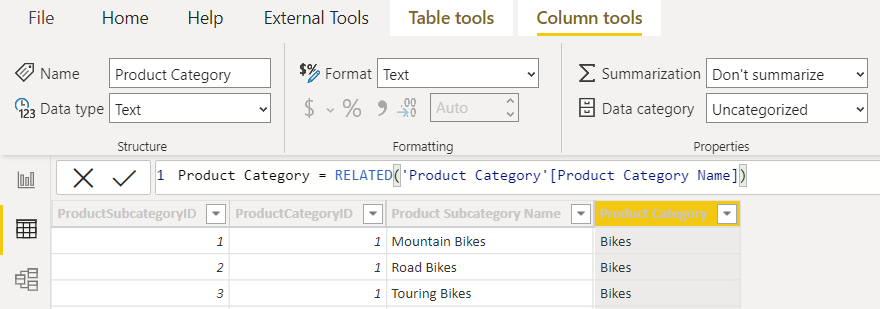

# 06-02 Opschonen en introductie calculated columns

Met alle relaties op de plaats kunnen we allerhande analyses uitvoeren op dit datamodel. Voordat we echter verder gaan maken we een korte pas op de plaats: kunnen we dit model wellicht wat gebruiksvriendelijker inrichten?

## Voorbereiding

We gaan verder met het rapport uit het vorig onderdeel van deze module.

Alternatief als je de vorige opdracht niet correct hebt afgerond:

**Open** het bestand [06-01-Solution](06-01-Solution.pbix)

## Opschonen van je model en calculated columns

Om het huidige model - dat direct uit een 3NF-bronsysteem afkomstig is - beter leesbaar te maken, kunnen we enkele zaken eenvoudig oppakken:

* Begrijpelijke namen toewijzen aan tabellen en kolommen
* Overbodige velden verwijderen
* Technische velden (zoals sleutels) verbergen
* Aantal niveaus in tabellen terugdringen

## Basis opschonen model

Om het model leesbaarder te houden, kunnen we overbodige kolommen verwijderen of verbergen.

* Bij verwijderen van een kolom wordt deze uit het datamodel verwijderd.
  * De kolom neemt dan geen ruimte meer in.
  * Dit doen we bijvoorbeeld voor niet-gebruikte kolommen die geen relevante betekenis voor ons hebben, of kolommen die bijzonder veel ruimte innemen zoals:
    * XML-data
    * Globally Unique IDentifiers (GUID-velden)
    * Afbeeldingen
* Bij verbergen van een kolom is deze standaard onzichtbaar voor een gebruiker.
  * Dit maakt het model meer toegankelijk, maar houdt de kolommen wel beschikbaar.
  * Dit is bijvoorbeeld handig voor ID-kolommen: die hebben geen betekenis, maar zijn wel belangrijk om bijvoorbeeld een relatie te leggen.

Voer de volgende zaken uit om het model leesbaarder te maken:

* Hernoem de tabellen
  * Person CountryRegion -> Country-Region
  * Sales SalesTerritory -> Sales Territory
  * Production Product -> Product
  * Production ProductSubcategory -> Product Subcategory
  * Production ProductCategory -> Product Category
  * "2014-01" -> Sales
* Hernoem de kolommen "Name" in elke tabel, zodat duidelijk is welke naam iets is
  * Bijv. in de tabel "Store" de kolom "Name" -> "Store Name"
* Hernoem de kolom "Group" in de tabel "Sales Territory" naar "Sales Territory Group"
* Verberg alle ID-kolommen
* Verwijder kolommen met XML- en GUID-data, en kolommen met de naam "ModifiedDate"

## Calculated Columns

In de "Data"-weergave van Power BI kun je eenvoudig bekijken welke data er momenteel in het datamodel zit.

We kunnen hier kolommen toevoegen die gevuld worden op basis van een DAX-expressie. Dit noemen we "Calculated columns".

* Voeg een nieuwe kolom toe aan de tabel "ProductSubcategory"

  * Typ de onderstaande expressie handmatig in:
  * Expressie: `Product Category = RELATED('Product Category'[Product Category Name])`

* Verberg nu de gehele tabel ProductCategory

Wanneer je nu naar de Report-weergave gaat, zul je zien dat er een tabel minder staat, en de naam van een productcategorie wordt weergegeven onder de tabel Product Subcategory. Er staat een klein "F(x)" teken bij om aan te geven dat het een calculated column is.

* Herhaal bovenstaande stappen om nu de namen van zowel de *productcategorie* als de *productsubcategorie* direct op te nemen in de *Product* tabel. Verberg ook de tabel *Product Subcategory*
* Voeg op dezelfde wijze de naam uit *Country-Region* toe aan *Sales Territory*, en verberg de tabel *Country-Region*

Zoals je ziet kun je hiermee relatief eenvoudig je model "platslaan" en meer toegankelijk maken voor gebruikers van Power BI.

## Oplossing

Hier vind je het eindpunt van deze opdracht: [06-02-Solution](06-02-Solution.pbix)

## Video

Hier vind je de [Walkthrough video](https://vimeo.com/584747355/e3b8b0302a)

## Volgende modules

De volgende module is [Module 7: Introductie Power Query (GUI)](../07-power-query-gui/09-power-query.md)

Hieronder vind je een overzicht van alle modules:

1. [Introductie Power BI Desktop](../01-introduction/01-introduction-powerbi-desktop.md)
2. [Rapporteren op Power BI Datasets en eerste visualisatie](../02-reporting-on-dataset/02-reporting-on-dataset.md)
3. [Visuals en interactie](../03-visuals-and-interaction/03-visuals-and-interaction.md)
4. [Drillthrough](../04-drillthrough/04-drillthrough.md)
5. Self-service reporting
   * [CSV-bestanden inladen](../05-self-service-reporting/05-csv-inladen.md)
   * [SQL data inladen](../05-self-service-reporting/06-sql-inladen.md)
6. Data Modeling 101
   * [Relaties](../06-data-modeling-101/07-relaties.md)
   * [Opschonen van je datamodel](../06-data-modeling-101/08-opschonen.md) (huidige module)
7. [Introductie Power Query (GUI)](../07-power-query-gui/09-power-query.md)
8. [Publiceren en samenwerken in workspaces](../08-publishing-and-collaboration-in-workspaces/10-publishing-and-collaboration-in-workspaces.md)
9. [Calculated Columns met DAX](../09-dax/11-calc-columns.md)
