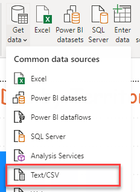

# CSV-data inladen, introductie Power Query en eerste visualisatie

In deze module laden we CSV-data in. Omdat CSV-data niet bijzonder scherp gedefinieerd is qua inhoud, kun je hier soms tegen uitdagingen aanlopen. We kijken daarom alvast een klein beetje naar Power Query om deze uitdagingen het hoofd te bieden. Ten slotte maken we een eerste visualisatie

## Voorbereiding

Start Power BI Desktop met een nieuw, leeg rapport zonder verbinding naar een kubus.

## CSV-Data inladen

Om een CSV-bestand in te laden ga je naar **Get Data** -> **Text/CSV**

Importeer het bestand ["2014-01.csv"](csv/2014-01.csv) uit de map "C:\Repos\powerbi-training\03-Self-service-reporting\csv".

## Data verkennen

Aan de rechterzijde zie je nu een tabel "2014-01" staan, met daaronder enkele velden. Momenteel zit er nog niet heel veel nuttige informatie in het datamodel: er is data van één periode uit 2014 aanwezig, maar alle verwijzingen naar winkels, producten en verkoopgebieden zijn enkel nog technische sleutels (de kolommen die een database onder water gebruikt om rijen uniek te kunnen identificeren - in dit geval bijv. `TerritoryID` en `ProductID`).

Maak nu drie Power BI visualisaties. Zorg ervoor dat de "per" velden hieronder niet worden gesommeerd, maar netjes uitsplitsen! Gebruik de standaard staafdiagrammen, en voer de bijbehorende wijzigingen door

1. **TotalDue** per **TerritoryID**
   * Maak de titel van de grafiek:
     * gecentreerd
     * rood
     * lettertype comic sans, 24pt (*en laat dit de laatste keer zijn dat je comic sans gebruikt in een datavisualisatie*)
   * Voeg voor **TerritoryID** een **Top 6 filter** toe, op basis van **TotalDue**
   * Verander de X-as van **Continuous** naar **Categorical**
   * Voeg een titel toe aan de X-as
2. **TaxAmt** per **ProductID**
   * Maak de X-as **Categorical**, en zet deze vervolgens uit
   * Stel als **Data colors** een **Conditional formatting** in (hint: klik op de puntjes naar *Default color*)
     * Stel de minimum-kleur in op de lichtste grijstint binnen de thema-kleuren
     * Stel de maximum-kleur in op de donkerste grijstint (niet zwart) binnen de thema-kleuren
     * Laat de overige instellingen standaard staan
     * Klik "OK"
3. Voeg een **slicer** toe voor het veld **Day**

> Wanneer je het bestand ["2014-01.csv"](csv/2014-01.csv) in een teksteditor bekijkt (op de cursus-VM staan o.a. *Visual Studio Code* en *Notepad++* geïnstalleerd), dan zul je zien dat het veld *Day* hier niet voorkomt. Power BI heeft hier gezien dat we een datum-veld in de brondata hadden zitten, en hier voor ons alvast een hiërarchie (Year, Quarter, Month, Day) op aangebracht.
>
> Handig, want veel van onze analyses zetten we uit over de tijd heen, en zelden hebben we daarbij het datum-niveau direct nodig!

Hieronder zie je een mogelijke uitkomst.

**Sla het bestand op - we gaan hier in het volgende onderdeel mee verder**.

## Volgende modules

Binnen deze module over Self-service reporting is de volgende les [SQL data inladen](../03-Self-service-reporting/04-sql-inladen.md). Hieronder vind je een overzicht van alle modules:

1. [Introductie Power BI Desktop](../01-Introduction/01-introductie-powerbi-desktop.md) (huidige module)
2. [Rapporteren op kubus-data en eerste visualisatie](../02-Reporting-on-Cube-Data/02-reporting-on-cube-data.md)
3. Self-service reporting
   * [CSV-bestanden inladen](../03-Self-service-reporting/03-csv-inladen.md)
   * [SQL data inladen](../03-Self-service-reporting/04-sql-inladen.md)
4. Data Modeling 101
   * [Relaties](../04-Data-Modeling-101/05-relaties.md)
   * [Opschonen van je datamodel](../04-Data-Modeling-101/06-opschonen.md)
   * [Verrijken met Calculated Columns](../04-Data-Modeling-101/07-calc-columns.md)
5. [Introductie Power Query (GUI)](../05-Power-Query-GUI/08-power-query.md)
