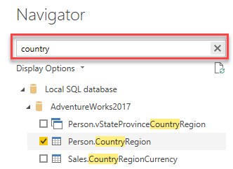

# SQL-bronnen inladen

## Voorbereiding

We gaan verder met het rapport dat we op een CSV-bestand hebben gebouwd.

## Inladen van SQL-data

De CSV-data uit de vorige opdracht was niet heel nuttig: er zat veel technische data in, en miste wat context. Om de data nu nuttiger te maken, gaan we er data uit andere tabellen aan toevoegen. Hiervoor maken we verbinding met de **SQL Server**-database die op je lokale VM staat:

* Adres: .

Laat de Data Connectivity mode op "Import" staan:

In het volgende venster word je gevraagd hoe je verbinding met deze database wilt maken. Laat de standaard-instelling voor **Windows** credentials en **use my current credentials** hier staan, klik op **Connect**.

Wanneer er een waarschuwing komt over een niet-versleutelde verbinding ("encryption support"), geef hier dan "OK":

Het venster "Navigator" opent. Klap hier de database "AdventureWorks2017" uit. Je ziet nu eerst een lijst van _views_, daaronder de _tabellen_ en uiteindelijk _table-valued functions_. Merk op dat hier verschillende icoontjes voor zijn! Selecteer de volgende _tabellen_:

* Person.CountryRegion
* Sales.SalesTerritory
* Production.Product
* Production.ProductSubcategory
* Production.ProductCategory

Je kunt hier de zoekfunctie voor gebruiken:

Klik op "Load" om de data in te laden.

Vervang nu in de rapportage de TerritoryID met de kolom "Name" uit SalesTerritory. Vervang ProductID door de kolom "Name" uit ProductCategory. Zet de weergave van de X-as weer aan voor deze grafiek.

Laad nu de tabel "Store" vanuit de Azure SQL Database "AdventureworksLT"

* server: bitrainer.database.windows.net
* database: AdventureWorksLT

Selecteer hiervoor **Database credentials**, met de volgende logingegevens:

* username: powerbiuser
* pass: PowerBI2

Voeg nu in het rapport achtereenvolgens de volgende velden toe:

1. Store -> Name
2. 2014-01 -> Freight

Zoals je ziet wordt voor elke winkel exact hetzelfde bedrag aan vrachtkosten ("freight") weergegeven. Dit is een indicator dat er relaties ontbreken.

## Volgende modules

De volgende module is Module 4: Data Modeling 101. Het eerste onderwerp hier is [Relaties](../04-Data-Modeling-101/05-relaties.md). Hieronder vind je een overzicht van alle modules:

1. [Introductie Power BI Desktop](../01-Introduction/01-introductie-powerbi-desktop.md) (huidige module)
2. [Rapporteren op kubus-data en eerste visualisatie](../02-Reporting-on-Cube-Data/02-reporting-on-cube-data.md)
3. Self-service reporting
   * [CSV-bestanden inladen](../03-Self-service-reporting/03-csv-inladen.md)
   * [SQL data inladen](../03-Self-service-reporting/04-sql-inladen.md)
4. Data Modeling 101
   * [Relaties](../04-Data-Modeling-101/05-relaties.md)
   * [Opschonen van je datamodel](../04-Data-Modeling-101/06-opschonen.md)
   * [Verrijken met Calculated Columns](../04-Data-Modeling-101/07-calc-columns.md)
5. [Introductie Power Query (GUI)](../05-Power-Query-GUI/08-power-query.md)
