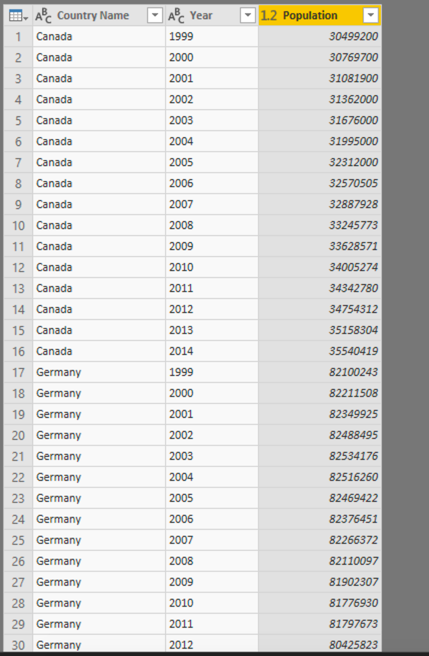
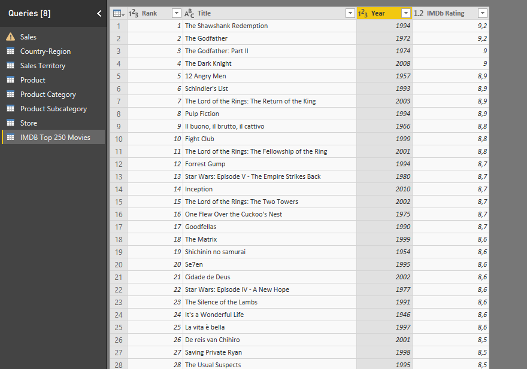

# Power Query via de GUI

In [module 2](02-csv-inladen.md) hebben we al kort gekeken naar Power Query: hoe het venster opgebouwd is, en hoe er achter de schermen code opgebouwd wordt.

In de meeste Power BI modellen zul je echter deze code niet hoeven te gebruiken: het grootste gedeelte van het werk is eenvoudig uit te voeren in de GUI. In deze module laden we een "lastig" bestand in via Power Query.

## Nieuwe aanlevering

Van één van onze analisten hebben we de vraag gekregen of er data kan worden toegevoegd over bevolkingscijfers aan het Power BI-model. Ze heeft de data aangeleverd in een [Excel-bestand](excel-aanlevering/pop-by-year.xlsx), dat er min of meer als volgt uitziet (voor de exacte indeling: open het [Excel-bestand](excel-aanlevering/pop-by-year.xlsx)):

| Total population is based on (...) |  |  |  |
| --- | --- | --- | --- |
| Source | `http://data.worldbank.org/indicator/SP.POP.TOTL` |  |  |
| Terms of use | `http://data.worldbank.org/summary-terms-of-use` |  |  |
|  |  |  |  |
| Country Name | 1999 | 2000 | (...) |
| Canada | 30499200 | 30769700 | (...) |
| Germany | 82100243 | 82211508 | (...) |
| (...) | (...) | (...) | (...) |

Dit is een structuur die traditioneel lastig in te lezen is in ETL-tools:

* Diverse beschrijvende rijen
* Koprij start niet bovenaan, maar pas op rij 5
* Jaren uitgesplitst over kolommen (in plaats van in rijen)

In een analyse-tool als Power BI zou je deze het liefst in de volgende structuur hebben:

| Country Name | Year | Population |
| --- | --: | --: |
| Canada | 1999 | 30499200 |
| Canada | 2000 | 30769700 |
| Germany | 1999 | 82100243 |
| Germany | 2000 | 82211508 |

In Power Query is deze data echter redelijk eenvoudig in te laden. Hieronder staat aangegeven welke zaken je hiervoor kunt gebruiken (uiteraard niet in een correcte volgorde of met concrete stappen). Kijk hoever je komt!

* *Unpivot columns* (of *Unpivot other columns*)
* *Hernoemen van kolommen*
* *Use First Row as Headers*
* Verwijderen van bestaande stappen (in de *applied steps* onder de *query settings* staan standaard enkele voorgestelde stappen - grote kans dat die niet direct correct zijn)
* *Remove Rows*

De uitkomst moet er als volgt uit zien:

## Bonus: de gekste datastructuren

Tot nu toe hebben we data van vier soorten bronnen ingeladen:

* CSV
* SQL Server
* Azure SQL Database
* Excel-bestanden in een onhandig formaat

Voor de bonus voegen we hier nog één bron aan toe: de IMDB top 250 van films [http://www.imdb.com/chart/top](http://www.imdb.com/chart/top). Hier kunnen we niet direct analyses op doen die aansluiten op ons huidige model, maar het geeft wel mooi aan wat er allemaal mogelijk is in Power BI.

Hieronder staat een screenshot hoe de data er uit moet komen te zien in Power Query. Je kunt de data inladen met "Get Data" -> "From Web".

Tip: Je zult hier de "split column" functionaliteit regelmatig nodig hebben

## Laatste module

Dit was de laatste module in deze cursus. Benieuwd naar meer? [BI Trainer.nl](https://www.bitrainer.nl/) biedt ook een verdiepende training [DAX voor Power BI - https://www.bitrainer.nl/dax](http://www.bitrainer.nl/dax).

Hieronder vind je een overzicht van alle modules:

1. [Introductie Power BI Desktop](../01-introduction/01-introduction-powerbi-desktop.md) 
2. [Rapporteren op kubus-data en eerste visualisatie](../02-reporting-on-cube-data/02-reporting-on-cube-data.md)
3. [Visuals en interactie](../03-visuals-and-interaction/03-visuals-and-interaction.md)
4. [Publiceren en samenwerken in workspaces](../04-publishing-and-collaboration-in-workspaces/04-publishing-and-collaboration-in-workspaces.md)
5. [Drillthrough](../05-drillthrough/05-drillthrough.md)
6. Self-service reporting
   * [CSV-bestanden inladen](../06-self-service-reporting/06-csv-inladen.md)
   * [SQL data inladen](../06-self-service-reporting/07-sql-inladen.md)
7. Data Modeling 101
   * [Relaties](../07-data-modeling-101/08-relaties.md)
   * [Opschonen van je datamodel](../07-data-modeling-101/09-opschonen.md)
   * [Verrijken met Calculated Columns](../07-data-modeling-101/10-calc-columns.md)
8. [Introductie Power Query (GUI)](../08-power-query-gui/11-power-query.md) (huidige module)
