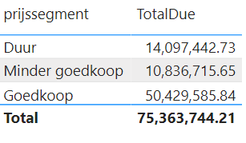
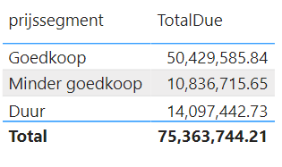

# Meer Calculated Columns

Met *calculated columns* kun je in een kolom voor elke rij van een tabel een berekening laten uitvoeren. In de vorige module hebben we hier een voorbeeld van gezien, waarbij in elke rij in de producttabel de bijbehorende subcategorie en categorie werd opgezocht via de functie `RELATED`.

In deze module kijken we naar andere mogelijkheden van _calculated columns_.
## Voorbereiding

Ga verder met het bestand dat je in de vorige module hebt gebruikt.

Alternatief als je de vorige opdracht niet hebt afgerond:

Open het Power BI template-rapport [**startpunt-module-8.pbit**](https://github.com/vstrien/powerbi-training/raw/master/08-publishing-and-collaboration-in-workspaces/startpunt-module-8.pbit)

De dataset die oorspronkelijk bij het rapport hoorde kun je niet direct benaderen. Daarom krijg je de foutmelding **Unable to connect**

* Klik op **Edit**
* Selecteer de **AdventureWorks** dataset uit je eigen workspace, en klik op **Create**

 
## Berekeningen

Bij het definiëren van _calculated columns_ kun je gebruikmaken van een heel arsenaal aan DAX-functies. Van heel geavanceerde (die feitelijk voor elke rij in de tabel een nieuwe query uitvoeren) tot basale functies als optellen en aftrekken.

Hieronder staan een paar opdrachten - kijk in hoeverre je ze kunt oplossen met een _calculated column_:

* In de tabel "Sales" willen we een nieuwe kolom met daarin subtotaal inclusief belastingen
* In de tabel "Product" willen we een nieuwe kolom met daarin een indicator of een product rood van kleur is
* In de tabel "Product" willen we een groepering van _listprice_.
  * Kolomnaam: "prijssegment_code"
  * _listprice_ = 0 -> _Blank_
  * _listprice_ tussen 0 en 1000 -> 1
  * _listprice_ tussen 1000 en 2000 -> 2
  * _listprice_ tussen 2000 en 3000 -> 3
  * _listprice_ tussen 3000 en 4000 -> 4
  * Probeer de weergave zo te krijgen dat dit als een geheel getal wordt weergegeven in het datamodel
* In de tabel "Product" willen we het prijssegment ook een label geven
  * Kolomnaam: "prijssegment"
  * 0: "Geen geld"
  * 1: "Goedkoop"
  * 2: "Minder goedkoop"
  * 3: "Duur"
  * 4: "Exorbitant"
* Wanneer je nu de verkopen groepeert per prijssegment in een visualisatie, zul je zien dat deze alfabetisch gesorteerd is:

* Zorg ervoor dat de sortering hiervan gaat op basis van de prijssegment_code. *Je hoeft hier geen DAX-expressies te gebruiken of aan te passen!*
* Verberg vervolgens de kolom "prijssegment_code"

## Visuele shizzle

Na de aanpassing van deze definities en codes, is het tijd om wat zaken aan te gaan passen in je rapport.

* Ga terug naar de *Report* weergave van Power BI, en voeg hier een nieuwe pagina toe
* Zorg ervoor dat deze er als volgt uit gaat zien.
  * Tip: je zult hier ook nog wat aanpassingen moeten doen aan de instellingen van je datamodel ...
  * ... maar je hoeft geen extra DAX-expressies, measues of calculated columns toe te voegen

## Oplossing

Hier vind je het eindpunt van deze opdracht:

[9 solution](https://github.com/vstrien/powerbi-training/raw/master/08-publishing-and-collaboration-in-workspaces/9%20solution.pbix)

## Video

Hier vind je de [Walkthrough video](https://vimeo.com/586426505/dffdaeb522)

## Laatste module

Dit was de laatste module in deze cursus. Benieuwd naar meer? [Wortell Smart Learning](https://www.wortell.nl/nl/smart-learning) biedt ook diverse verdiepende trainingen op het gebied van Power BI. Kijk voor meer info op [https://www.wortell.nl/nl/smart-learning](https://www.wortell.nl/nl/smart-learning).

Hieronder vind je opnieuw de inhoudsopgave met alle modules in de training:

1. [Introductie Power BI Desktop](../01-introduction/01-introduction-powerbi-desktop.md)
2. [Rapporteren op Power BI Datasets en eerste visualisatie](../02-reporting-on-dataset/02-reporting-on-dataset.md)
3. [Visuals en interactie](../03-visuals-and-interaction/03-visuals-and-interaction.md)
4. [Drillthrough](../04-drillthrough/04-drillthrough.md)
5. Self-service reporting
   * [CSV-bestanden inladen](../05-self-service-reporting/05-csv-inladen.md)
   * [SQL data inladen](../05-self-service-reporting/06-sql-inladen.md)
6. Data Modeling 101
   * [Relaties](../06-data-modeling-101/07-relaties.md)
   * [Opschonen van je datamodel](../06-data-modeling-101/08-opschonen.md)
7. [Introductie Power Query (GUI)](../07-power-query-gui/09-power-query.md)
8. [Publiceren en samenwerken in workspaces](../08-publishing-and-collaboration-in-workspaces/10-publishing-and-collaboration-in-workspaces.md)
9. [Calculated Columns met DAX](../09-dax/11-calc-columns.md) (huidige module)
